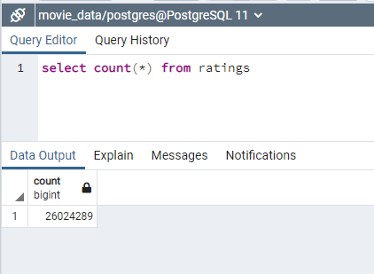
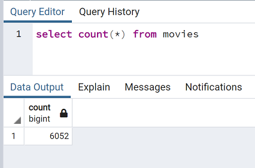

# Movie Info and Ratings Database

This challenge has 4 parts that build on one anther to create a database of movies and associated ratings.  The function in the final step of the challenge is created so it can be run against newly downloaded files.  The files are found here:

Deliverable 1 - [ETL_function_test.ipynb](ETL_function_test.ipynb)

Deliverable 2 - [ETL_clean_wiki_movies.ipynb](ETL_clean_wiki_movies.ipynb)

Deliverable 3 - [ETL_clean_kaggle_data.ipynb](ETL_clean_kaggle_data.ipynb)

Deliverable 4 - [ETL_create_database.ipynb](ETL_create_database.ipynb)

  <B>Image of Ratings Table Count</B>                                                     
  

  <B>Image of Movies Table Count</B>                                                     
  
